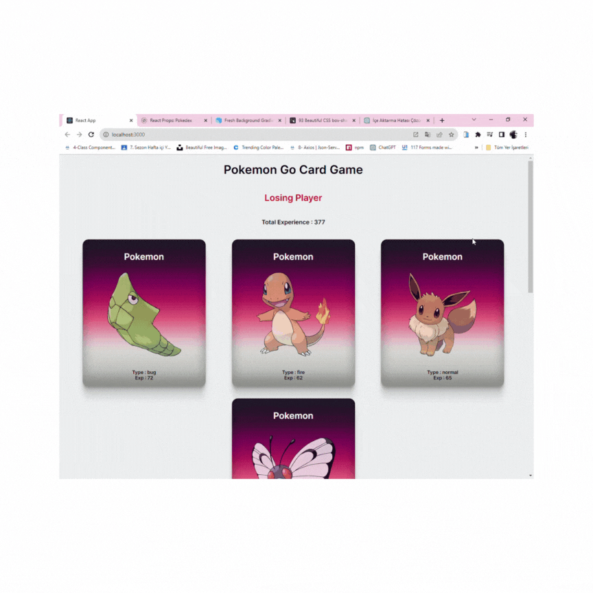

## Pokémon Oyunu React

Bu proje, React kullanılarak geliştirilmiş bir web tabanlı Pokémon oyununu içerir.

## Kullanım

Projeyi çalıştırmak için aşağıdaki adımları takip edebilirsiniz:

1. Bu depoyu klonlayın.
2. Gerekli bağımlılıkları yüklemek için `npm install` komutunu kullanın.
3. Oyunu başlatmak için `npm start` komutunu kullanın.
4. Tarayıcınızda [http://localhost:3000](http://localhost:3000) adresini açarak oyunu görüntüleyebilirsiniz.

## Katkıda Bulunma

Katkılarınızı memnuniyetle karşılıyoruz. Projeye katkıda bulunmak için [Katkıda Bulunma Rehberi](CONTRIBUTING.md) dosyasını okuyun.

## Lisans

Bu proje MIT Lisansı ile lisanslanmıştır. Daha fazla ayrıntı için [LİSANS](LICENSE) dosyasına başvurun.

## İletişim

Sorularınız veya destek için support@example.com adresinden bizimle iletişime geçebilirsiniz.
